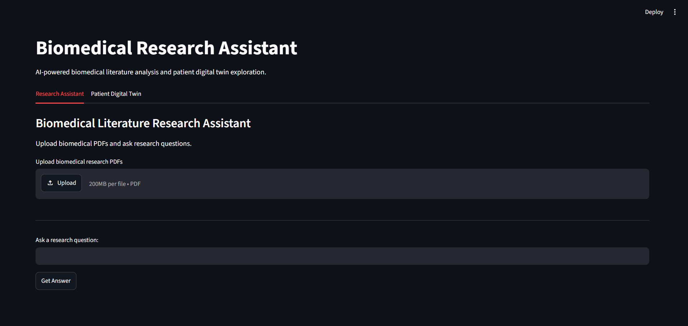
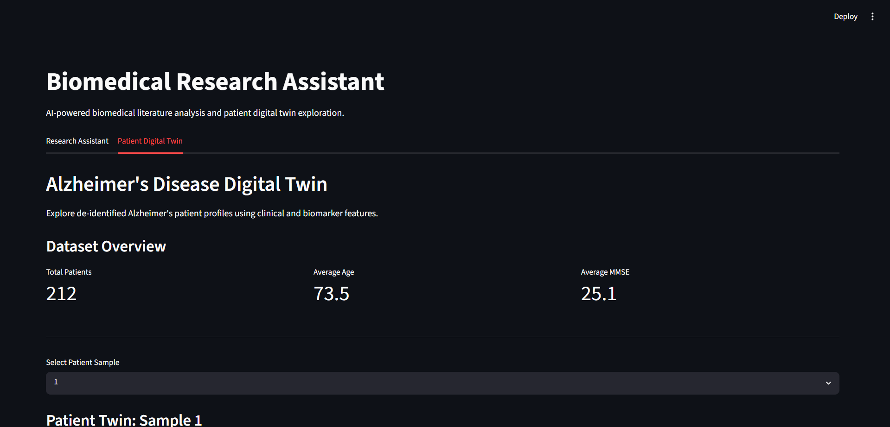
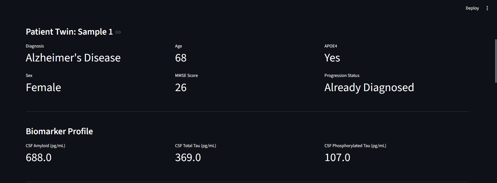
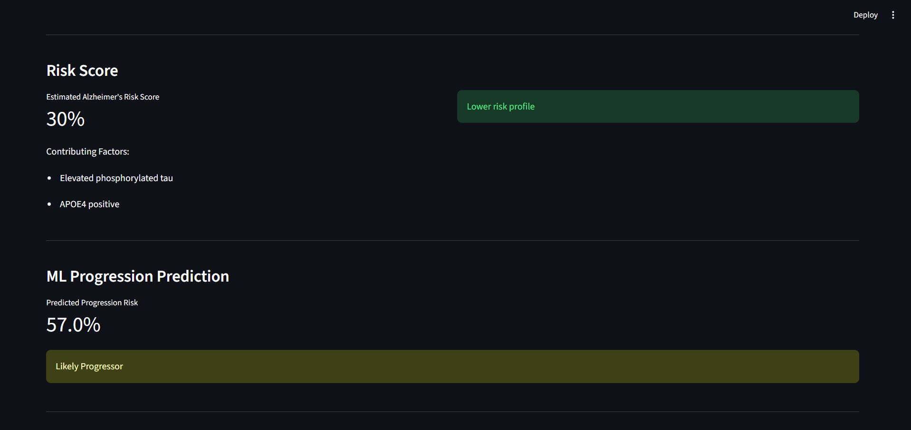
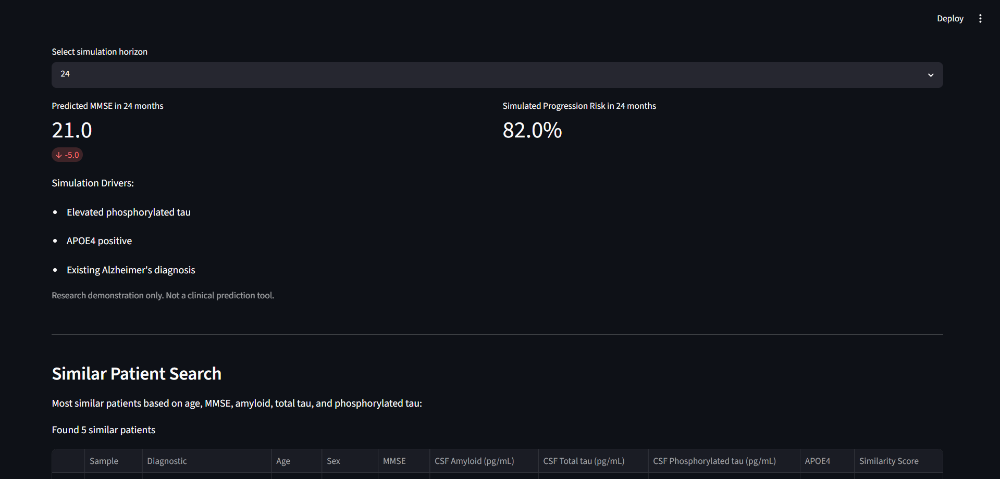
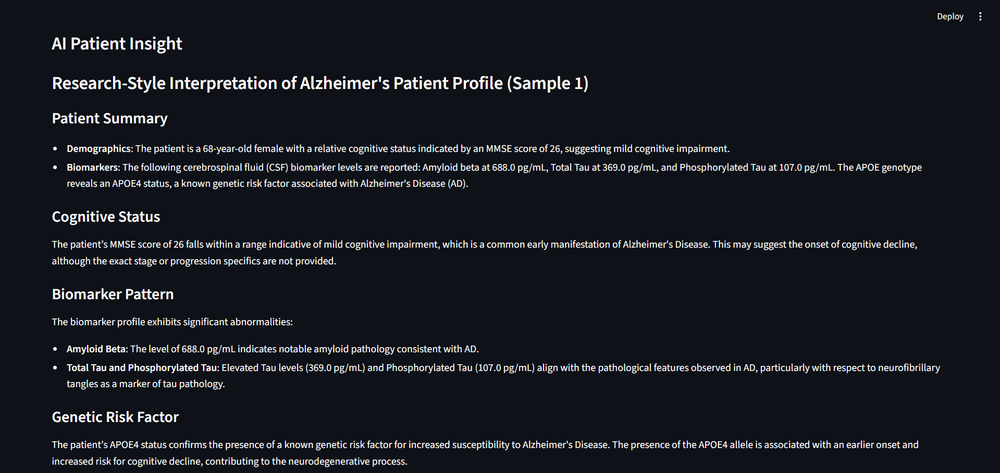
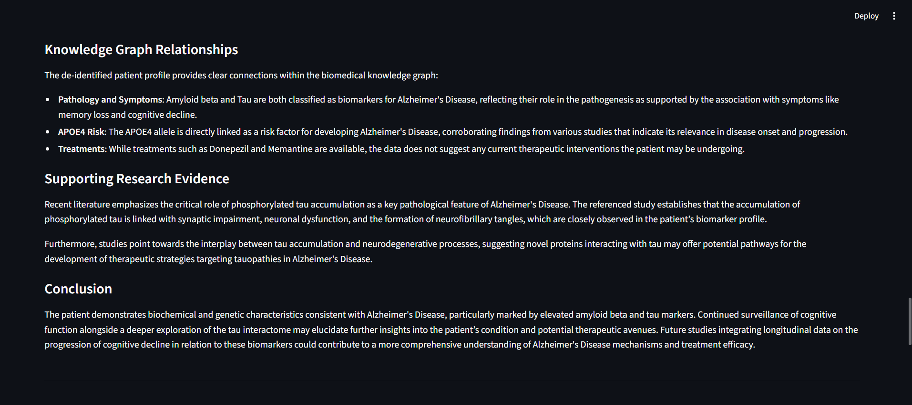
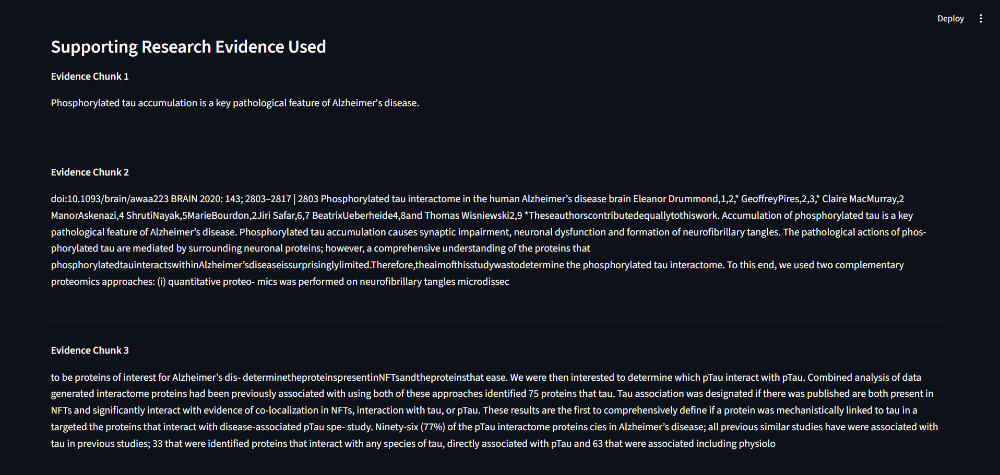

# Biomedical Research Platform & Alzheimer's Disease Digital Twin

## Overview

The Biomedical Research Platform & Alzheimer's Disease Digital Twin is an AI-powered research platform that combines biomedical literature analysis, retrieval-augmented generation (RAG), machine learning, knowledge graphs, and patient-level disease modeling.

The platform enables researchers to:

* Upload and analyze biomedical research papers
* Ask natural language questions using AI-powered literature retrieval
* Explore Alzheimer's disease patient profiles
* Predict disease progression risk using machine learning
* Discover similar patient cohorts
* Leverage biomedical knowledge graph relationships
* Generate AI-powered patient insights grounded in research evidence
* Simulate future disease trajectories using a digital twin framework

---

# System Architecture

## Research Literature Pipeline

```text
Biomedical PDFs
        ↓
Text Extraction
        ↓
Chunking
        ↓
Embeddings
        ↓
ChromaDB
        ↓
Semantic Retrieval
        ↓
GPT-Powered Question Answering
```

## Digital Twin Pipeline

```text
Patient Dataset
        ↓
Biomarker Analysis
        ↓
Risk Scoring
        ↓
ML Progression Prediction
        ↓
Similar Patient Search
        ↓
Knowledge Graph Reasoning
        ↓
Research Evidence Retrieval
        ↓
AI Patient Insight
        ↓
Disease Progression Simulation
```

---

# Screenshots

## Research Assistant

Upload biomedical PDFs and perform AI-powered literature analysis.



---

## Patient Digital Twin Dashboard

Explore patient demographics, diagnosis information, biomarkers, and progression status.





---

## Risk Score & Machine Learning Prediction

Rule-based Alzheimer's risk scoring combined with machine learning progression prediction.



---

## Disease Progression Simulation

Simulate future cognitive decline and progression risk across different time horizons.



---

## AI Patient Reasoning

AI-generated patient interpretation using:

* Patient clinical data
* Biomarker information
* Knowledge graph relationships
* Research evidence retrieved from uploaded literature







---

# Features

## 1. Biomedical Research Assistant

### Capabilities

* Upload multiple biomedical research PDFs
* Extract scientific text automatically
* Generate embeddings
* Store embeddings in ChromaDB
* Retrieve relevant research evidence
* Ask natural language research questions
* Receive AI-generated answers grounded in uploaded literature

### Technologies

* Streamlit
* pdfplumber
* ChromaDB
* Sentence Transformers
* OpenAI GPT-4o-mini

---

## 2. Alzheimer's Disease Digital Twin

The platform includes an Alzheimer's disease digital twin environment built using de-identified patient data.

### Patient Information

* Age
* Sex
* MMSE Score
* APOE4 Status
* Diagnostic Group
* CSF Amyloid
* CSF Total Tau
* CSF Phosphorylated Tau
* Disease Progression Information

---

## 3. Biomarker Dashboard

Displays:

* CSF Amyloid (pg/mL)
* CSF Total Tau (pg/mL)
* CSF Phosphorylated Tau (pg/mL)

These biomarkers are commonly used in Alzheimer's disease research and diagnostics.

---

## 4. Alzheimer's Risk Scoring Engine

A rule-based scoring framework evaluates:

* MMSE Score
* Amyloid Levels
* Total Tau
* Phosphorylated Tau
* APOE4 Status

### Outputs

* Estimated Alzheimer's Risk Score
* Contributing Risk Factors

---

## 5. Machine Learning Progression Prediction

A supervised machine learning model predicts:

### Target Variable

Progression to Alzheimer's Disease

### Input Features

* Age
* MMSE
* CSF Amyloid
* CSF Total Tau
* CSF Phosphorylated Tau
* APOE4 Status

### Model

Random Forest Classifier

### Outputs

* Predicted Progression Risk
* Likely Progressor Classification

---

## 6. Similar Patient Search

The system identifies clinically similar patients using:

* Age
* MMSE
* Amyloid
* Total Tau
* Phosphorylated Tau

### Outputs

* Top Similar Patients
* Similarity Scores
* Cohort-Based Comparison

---

## 7. Biomedical Knowledge Graph

A lightweight biomedical knowledge graph captures relationships between diseases, biomarkers, genes, symptoms, and treatments.

### Example Relationships

```text
Amyloid Beta
    → associated_with
    → Alzheimer's Disease

Tau
    → biomarker_for
    → Alzheimer's Disease

Phosphorylated Tau
    → biomarker_for
    → Alzheimer's Disease

APOE4
    → risk_factor_for
    → Alzheimer's Disease

Donepezil
    → treatment_for
    → Alzheimer's Disease

Memantine
    → treatment_for
    → Alzheimer's Disease
```

---

## 8. AI Patient Reasoning

The AI reasoning engine combines:

### Patient Data

* Demographics
* Biomarkers
* Diagnosis

### Knowledge Graph

* Disease relationships
* Biomarker relationships
* Genetic risk factors

### Research Evidence

Retrieved from uploaded biomedical literature using ChromaDB semantic search.

### Outputs

* Cognitive status interpretation
* Biomarker interpretation
* Genetic risk analysis
* Disease progression discussion
* Research-supported reasoning

---

## 9. Supporting Research Evidence

For every generated patient insight, the platform displays:

* Retrieved research chunks
* Scientific evidence used by the AI
* Transparent reasoning support

This improves explainability and trustworthiness.

---

## 10. Disease Progression Simulation

The digital twin includes a future disease trajectory simulator.

### Simulation Horizons

* 6 Months
* 12 Months
* 24 Months

### Simulated Outputs

* Predicted MMSE Score
* Future Progression Risk
* Drivers of Disease Progression

### Example

```text
Current MMSE: 26

Predicted MMSE in 24 Months: 21

Estimated Cognitive Change: -5 Points
```

---

# Project Structure

```text
bio-research-platform/

├── frontend/
│   └── app.py
│
├── graph/
│   ├── entity_extractor.py
│   ├── build_knowledge_graph.py
│   ├── biomedical_entities.csv
│   └── knowledge_graph.csv
│
├── models/
│   ├── train_progression_model.py
│   └── progression_model.pkl
│
├── data/
│   └── patient_data.csv
│
├── database/
│   └── chroma_db/
│
├── embeddings/
├── ingestion/
├── rag/
├── tests/
├── docs/
└── README.md
```

---

# Installation

## Clone Repository

```bash
git clone <repository-url>
cd bio-research-platform
```

## Create Virtual Environment

```bash
python -m venv venv
```

## Activate Environment

### Windows

```bash
venv\Scripts\activate
```

### Linux / Mac

```bash
source venv/bin/activate
```

## Install Dependencies

```bash
pip install streamlit
pip install pdfplumber
pip install chromadb
pip install sentence-transformers
pip install openai
pip install pandas
pip install scikit-learn
pip install joblib
```

Or:

```bash
pip install -r requirements.txt
```

---

# Running the Application

```bash
streamlit run frontend/app.py
```

Application launches at:

```text
http://localhost:8501
```

---

# Current Capabilities

### Research Platform

* PDF Processing
* Literature Search
* Semantic Retrieval
* Research Q&A

### Digital Twin

* Patient Dashboard
* Biomarker Analysis
* Risk Scoring
* ML Progression Prediction
* Similar Patient Search
* Knowledge Graph Integration
* Research Evidence Retrieval
* AI Patient Reasoning
* Disease Progression Simulation

---

# Future Roadmap

## Knowledge Graph Expansion

* Automated entity extraction from uploaded papers
* Dynamic graph generation
* Neo4j graph database integration

## Disease Modeling

* What-if scenario simulation
* Treatment response simulation
* Longitudinal disease trajectories

## Biomedical AI

* Multi-paper evidence synthesis
* Agentic scientific reasoning
* Automated hypothesis generation

## Advanced Biology Integration

* Genomics
* Proteomics
* Transcriptomics
* Multi-Omics Digital Twins

## Clinical Readiness

* Explainability reports
* Audit trails
* Model monitoring
* Regulatory workflows

---

# Technologies Used

### Frontend

* Streamlit

### AI / LLM

* OpenAI GPT-4o-mini
* Retrieval-Augmented Generation (RAG)

### Machine Learning

* Scikit-learn
* Random Forest

### Vector Database

* ChromaDB

### Data Processing

* Pandas
* NumPy
* pdfplumber

### Knowledge Graph

* Custom Biomedical Knowledge Graph

---

# Disclaimer

This project is intended solely for research, educational, and demonstration purposes.

The risk scores, progression predictions, patient insights, and disease simulations generated by this platform are experimental prototypes and must not be used for clinical diagnosis, treatment recommendations, or medical decision-making.


## Deployment

### Live Application

https://bio-research-assistant-raghava.streamlit.app/

### Source Code

https://github.com/raghavav635-collab/bio-research-platform

---

## Author

### Raghava V

Machine Learning Engineer | Generative AI | RAG | NLP | MLOps

University of North Texas – Advanced Data Analytics

LinkedIn: https://linkedin.com/in/raghava16

Email: [raghavav635@gmail.com](mailto:raghavav635@gmail.com)
